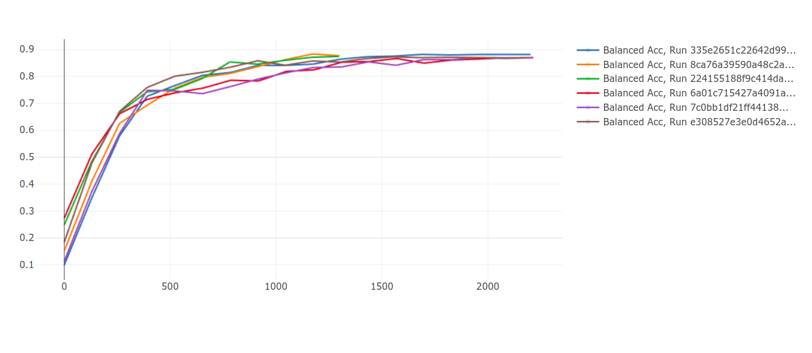

# Clasificación de preguntas de clientes Santander 
## :trophy: Primer puesto (0.883 score público) 

En este repo se puede encontrar la solución con la que alcancé el primer puesto en el leaderboard público de la competencia de [Metadata ECI Clasificación de preguntas de clientes](https://metadata.fundacionsadosky.org.ar/competition/21/).

La solución está basada en un **Voting** Hard sobre **6 modelos** entrenados sobre [BETO](https://github.com/dccuchile/beto).

El código está dividido en dos partes: **modelado del lenguaje** y **clasificador**.

**AVISO**: el código no está para nada pulido así que si no se entiende algo pueden preguntarme!

# Modelado del lenguaje
En el notebook **Language Model** se puede encontrar el finetuning realizado sobre Beto para adaptarlo al problema

# Clasificador
En el notebook **Ensamble de Betos** se encuentra el código utilizado para los múltiples entrenamientos y las predicciones.

En la siguiente imagen se pueden ver el score alcanzado en entrenamiento de lo 6 mejores modelos:

